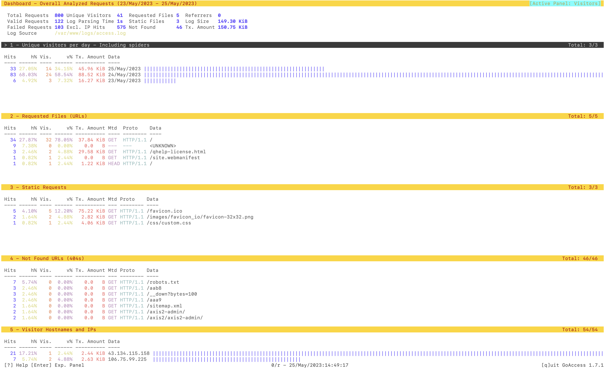

# GoAccess Tools for OpenBSD 7.3

[GoAccess](https://goaccess.io/) is an open source **real-time** **web log analyzer** and interactive viewer that runs in a **terminal** in *nix systems or through your **browser**.

It provides **fast** and valuable HTTP statistics for system administrators that require a visual server report on the fly.

----




## Summary

OpenBSD has some quirks dealing with log formats so to make it easier I have made a preconfigured *goaccess.conf* and some simple shell scripts to execute commands that work with the default package version of GoAccess provided by OpenBSD using self same conventions.


## Features

* OpenBSD Themed

* Automatic [ASN Database](https://www.arin.net/resources/guide/asn/) Download and Configuration Option

  * Options for DB-IP, MaxMind Github 

* IP Exclusions for [Uptime Robot](https://uptimerobot.com/?rid=d8e3c5122ea836) Web Monitoring 

* Simplified shell script for single and combined log reporting output to HTML

  

## Obtain

1. `pkg_add goaccess`


## Backup

1. Backup `/etc/goaccess/goaccess.conf` and then put repository version in place


## Execute

1. `chmod 750 goaccess.sh`
2. `goaccess` (Uses OpenBSD theme, GeoIP, ASN, and Exclusions)
    1. Downloads database to default `/var/db/GeoIP` installed by the OpenBSD binary

3. `goaccess.sh` to create an HTML report for the current access.log *(ignores goaccess.conf)*
4. `goaccess.sh full` to combine all logs (including gzipped) into one report *(ignore goaccess.conf)*
5. Check your `/var/log`
    1. `goaccess-report-Month-Day.html`
    2. `goaccess-total-report.html`


## Customize

After you've made your first reports you can choose to get more out of your logs and GoAccess

1. Add your ASN provider in the `CUSTOMIZE` section *(does not permit authenticated logins)*

2. Once you have download the ASN database via the script edit your `/etc/goaccess/goaccess.conf`

   1.  Line 839 `geoip-database /var/db/GeoIP/ASN.mmdb`

3. Using with [MaxMind Data](https://www.maxmind.com/en/accounts/871098/geoip/downloads) on a free account 

   1.  GeoIP **Country** Data: Copy database to `/var/db/GeoIP/GeoLite2-Country.mmdb`

   2.  GeoIP **City** Data: Download database to `/var/db/GeoIP/GeoLite2-City.mmdb`

       1.  Insert into `goasscess.conf` line 840 `geoip-database /var/db/GeoIP/GeoLite2-City.mmdb`

   3.  **MaxMind ASN** Autoupdate requires this `ASN_URL` with your **license key added** to the URL

       1.  ```
           https://download.maxmind.com/app/geoip_download?edition_id=GeoLite2-ASN&license_key=YOUR_LICENSE_KEY&suffix=tar.gz
           ```

4. Inside the `server` section of your `httpd.conf` add the directive `log style combined`

   1.  `rcctl reload httpd`

5. Change shell script as needed. Add any [options](https://goaccess.io/man#options) for the shell script, some popular ones:
   * `--exclude-ip='216.144.248.23'`
   * `--unknowns-log=<filename>`
   * `--invalid-requests=<filename>`

---


**LICENSE**

[GoAccess Tools for OpenBSD](https://bitbucket.org/quadhelion-engineering/goaccess-openbsd) © 2023 by [Elias Christopher Griffin](https://www.eliasgriffin.com) is licensed under CC BY-NC-SA 4.0. To view a copy of this license, visit http://creativecommons.org/licenses/by-nc-sa/4.0/
